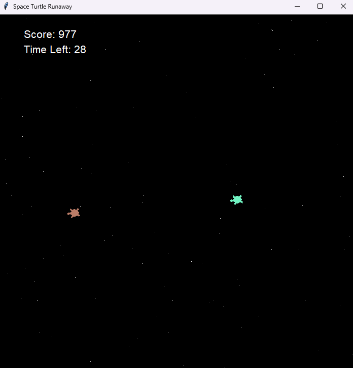

# oss-lab #3:🐢 Space Turtle Runaway 🌌

Welcome to **Space Turtle Runaway**! In this fun game mode, you’ll take control of a turtle trying to catch a relentless runner. Can you outsmart your opponent and be the best turtle chaser of all galaxies? Let's find out! 🏃‍♂️💨

## 🎮 How to Play

1. **Control the Runner:** Use the **arrow keys** on your keyboard to move your turtle:
   - **Up Arrow**: Move Forward
   - **Down Arrow**: Move Backward
   - **Left Arrow**: Turn Left
   - **Right Arrow**: Turn Right

2. **Starting the Runaway:** First, the turtles will test your patience. Wait for the ***space dimension*** to be generated before starting to chase! 

2. **Objective**: In this game mode, you're the Space Turtle **Chaser**! So try your best to catch the runner!

3. **Game Over**: If you catch the runner, or if the timer runs out, the game will end, and the results will be displayed.

## 📸 Screenshot

## ⚡ Features
- Gameplay with a timer and score calculated by the time that has passed and moves.
- Colorful turtles that change colors every few seconds for more difficulty.
- Pixelated starry background for a cool experience!
- Arcade music to bring you closer to the Turtle Galaxy!

## 🎉 Have Fun!
Enjoy the game and challenge your friends to beat your high score! 🌟