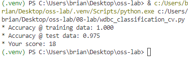

# ML Lab #2: Breast Cancer Classification with Gradient Boosting

This assignment solution classifies breast cancer data from the Breast Cancer Wisconsin (Diagnostic) Data Set using a Gradient Boosting Classifier with cross-validation.

## Overview

- **Objective**: Achieve the best classification accuracy using the given dataset.
- The dataset contains 569 instances with 30 attributes each, used to classify tumors as either malignant or benign.

## Methodology

- **Model Used**: Gradient Boosting Classifier from `sklearn`.
- **Cross-Validation**: Performed with 5 folds to evaluate model performance on training and test data.
- **Hyperparameters**:
  - `n_estimators`: 100
  - `learning_rate`: 0.693
  - `max_depth`: 3
  - `min_samples_split`: 6
  - `min_samples_leaf`: 1
  - `max_features`: 'sqrt'
  - `random_state`: 2

## Results
After executing the `wdbc_classification_cv.py` script, these are the results:
- **Training Accuracy**: 1.000
- **Test Accuracy**: 0.975
- **Score**: 18, calculated using the given formula: `10 + 100 * (test_accuracy - 0.9)`

## Screenshot

Below is the output visualization of the classification results:

