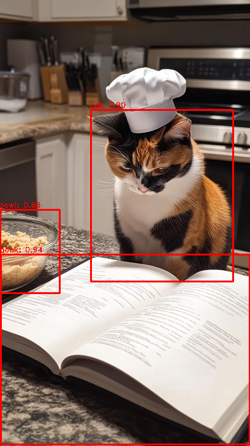

# DL Lab #1: Object Detection using YOLO

This assignment utilizes PyTorch and YOLO to perform object detection on the provided image `test.jpg` using the given `pytorch_yolo.ipynb` notebook.

## Overview

- **Objective**: Detect objects in an image using YOLO with PyTorch.
- **Tools Used**:
  - Google Colab
  - PyTorch
  - YOLO model (`yolov5l` from PyTorch Hub)
- **Inputs**:
  - `pytorch_yolo.py` (skeleton code)
  - `test.jpg` (test image)
- **Outputs**:
  - Detection results visualized on the input image.
  - Screenshot saved as `screenshot.png`.

## Steps

1. **Set up the Environment**:
   - Verified GPU availability.
   - Loaded YOLOv5 model from PyTorch Hub.
   
2. **Object Detection**:
   - Uploaded `test.jpg`.
   - Ran the YOLO model for object detection.
   - Visualized the results.

3. **Result**:
   - Detection results saved in `screenshot.png`.

## Results

The following is the visualization of the detection results:

